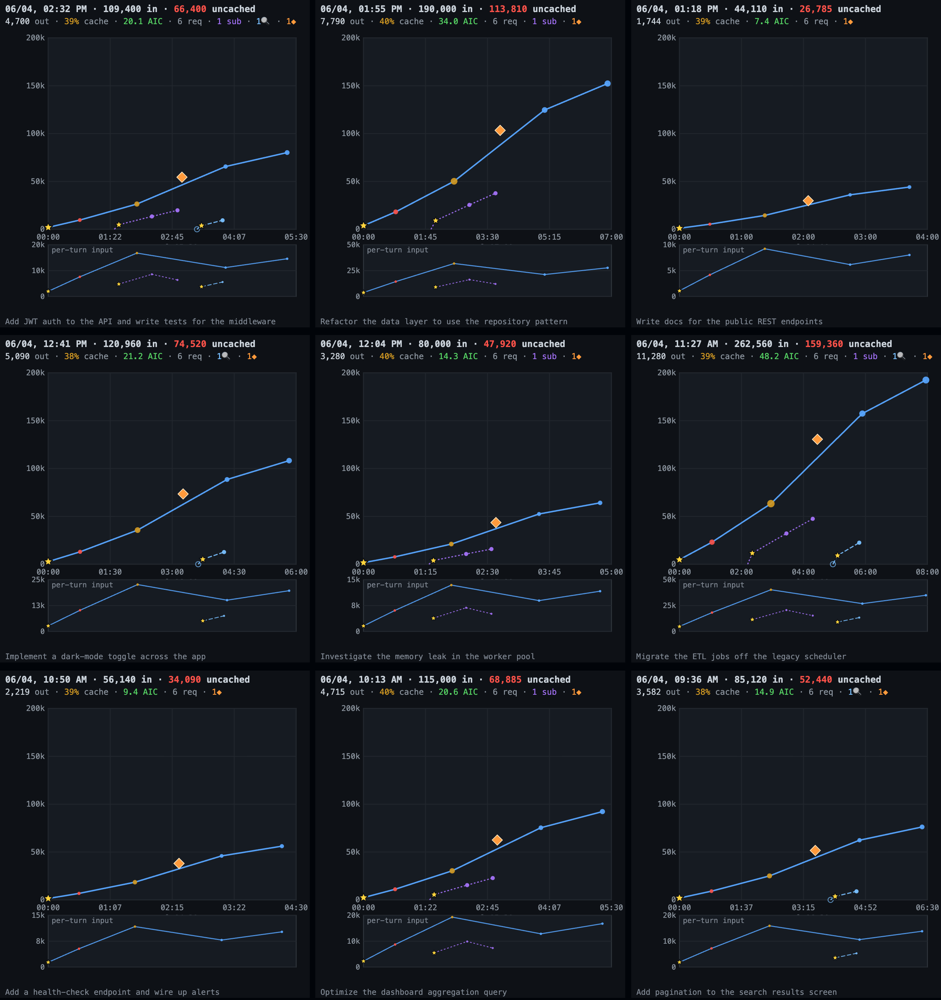
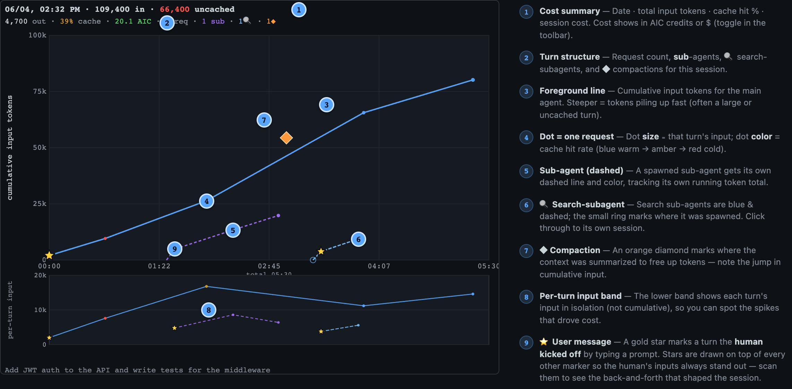
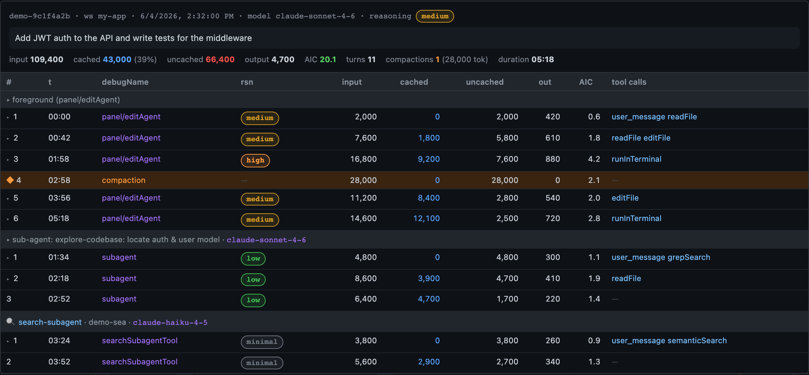
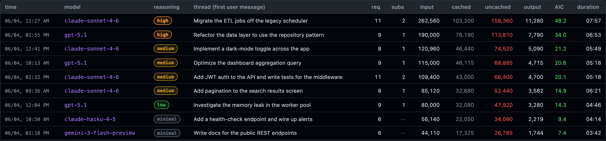
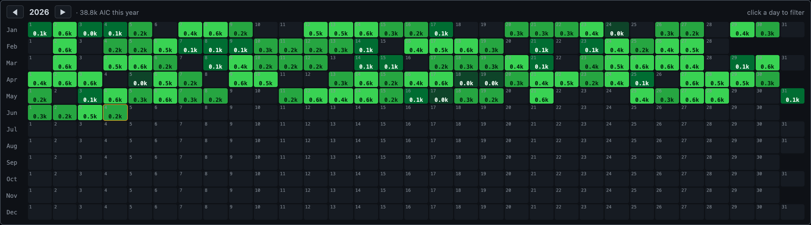
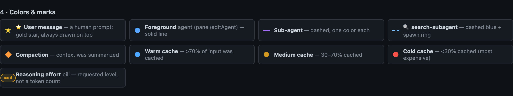

# data-viz-copilot-usage

Interactive web viewer for VS Code Copilot chat token usage. Reads the local debug-logs that the Copilot extension writes under VS Code's `workspaceStorage` directory (`<workspaceStorage>/<wsid>/GitHub.copilot-chat/debug-logs/`) and turns each session into a small-multiple chart of cumulative token use over time, with a drill-in modal showing every LLM call and the tool invocations that fed it.

The log location is auto-detected per platform:

| Platform | workspaceStorage                                                        |
| -------- | ----------------------------------------------------------------------- |
| macOS    | `~/Library/Application Support/Code/User/workspaceStorage`              |
| Linux    | `$XDG_CONFIG_HOME/Code/User/workspaceStorage` (default `~/.config/...`) |
| Windows  | `%APPDATA%\Code\User\workspaceStorage`                                  |

Using VS Code Insiders, VSCodium, or a portable install? Point the `COPILOT_USAGE_STORAGE` env var at the equivalent `workspaceStorage` directory.

## Visuals

These are the same annotated examples from the in-app **guided tour** (the `? Help` button in the toolbar), which renders a live demo session — one main agent that spawned two sub-agents.

### Small multiples, one per session

The default view: a grid of cards, one per session, on a shared y-scale so the heaviest hitter fills the frame. Click any card to drill into its detail.



### Anatomy of a chart

Each card is one session. The big band plots cumulative input tokens over time; the band below plots per-turn input. Dot size ∝ that turn's input; dot color = cache hit rate.



### Detailed view, session

Click any card or row to open the per-turn detail — every LLM call, its reasoning level, input/cached/output, cache-hit bar, and the tools that fired before that turn.



### Table rollup — a day's worth of usage

The `table` toggle swaps the grid for a sortable rollup, one row per thread: model, reasoning level, request and sub-agent counts, input/cached/uncached/output tokens, cost, and duration. Click any column header to re-sort.



### AIC calendar

The 📅 calendar is a GitHub-style year heatmap of daily spend. Click a day to filter the view to it; the unit toggle switches between AIC credits and dollars.



### Colors & marks



## Run

Requires [uv](https://github.com/astral-sh/uv).

```sh
git clone https://github.com/byronwall/data-viz-copilot-usage.git
cd data-viz-copilot-usage
uv run app.py
```

Then open <http://localhost:5057>.

CLI flags:

```sh
uv run app.py --port 8000 --host 0.0.0.0 --debug
```

uv will create `.venv/` and install Flask on the first run; subsequent runs are instant.

## What you see

- **Default view**: top 50 sessions from the last 24h, sorted by total input tokens.
- **Filters** in the header: time window (1h … 90d), sort key, top-N cap, minimum-token floor.
- **Each card**: a small line chart. y = cumulative input tokens (shared scale across all cards in the result set so the heaviest hitter fills the frame). x = wall-clock time from first activity (per-card scale). Solid blue = the foreground `panel/editAgent` chat. Dashed colored lines = sub-agents (`runSubagent-*`). Orange diamonds = compaction events (`summarizeConversationHistory*`, `summarizeVirtualTools`). Dot size encodes per-turn input tokens. Dot color encodes cache hit on that turn (blue ≥70% / amber 30–70% / red <30%).
- **Click a card** → fullscreen modal with the chart on the left and a per-turn detail table on the right. Hover any dot to highlight (and scroll to) the matching row, and vice versa. Each row shows debugName, reasoning level, input/cached/output, cache-hit bar, and the tools that fired before that turn.
- **`charts` / `table` toggle** (below the controls): switch the result set between the small-multiples grid and a tabular rollup — one row per thread (session), with columns for model, reasoning level, request count, input/cached/cache%/output tokens, AIC, and duration. Click a column header to sort; click a row to open the same detail modal as a card. The active view persists in the URL (`?view=table`).
- **Reasoning level** is the requested effort, *not* a token count — VS Code Copilot doesn't log reasoning tokens separately (they're folded into `output`). It's read from each request's `requestOptions`: OpenAI `reasoning.effort` (`low`/`medium`/`high`/`xhigh`) or Anthropic `thinking.budget_tokens` (shown as `think:16k`). The pill is color-ramped low→high so different reasoning levels are comparable at a glance.

## Endpoints

- `GET /` — UI
- `GET /api/sessions?since_hours=24&min_tokens=0&limit=50&sort=total_input` — list of session summaries (no per-tool detail)
- `GET /api/session/<sid>` — full detail for one session (every LLM call and its preceding tool invocations)
- `GET /api/stats?since_hours=24` — high-level rollup

`sort` values: `total_input` · `recent` · `uncached` · `requests` · `duration`.

## How it works

`analyzer.py` discovers `main.jsonl` files via the workspaceStorage glob. For each session it parses the foreground log plus any sibling `*.jsonl` files (those are child sessions — `runSubagent-*` and `title-*`). Files are cached in-memory keyed by mtime so repeated queries are cheap. The frontend renders SVG directly in the browser from the JSON payload so filtering is responsive.

## Notes

- VS Code Copilot only logs caching info for some sessions/models. `gemini-3-flash-preview` shows ~17% cache; `gpt-5.x` typically 88–95%.
- Sessions reopened across multiple days will have a `duration` that includes the idle gap.
- "Find relevant code snippets for: …" sessions are standalone subagent search sessions (separate session dirs, no parent linkage in the log files), so they show up as their own cards.
